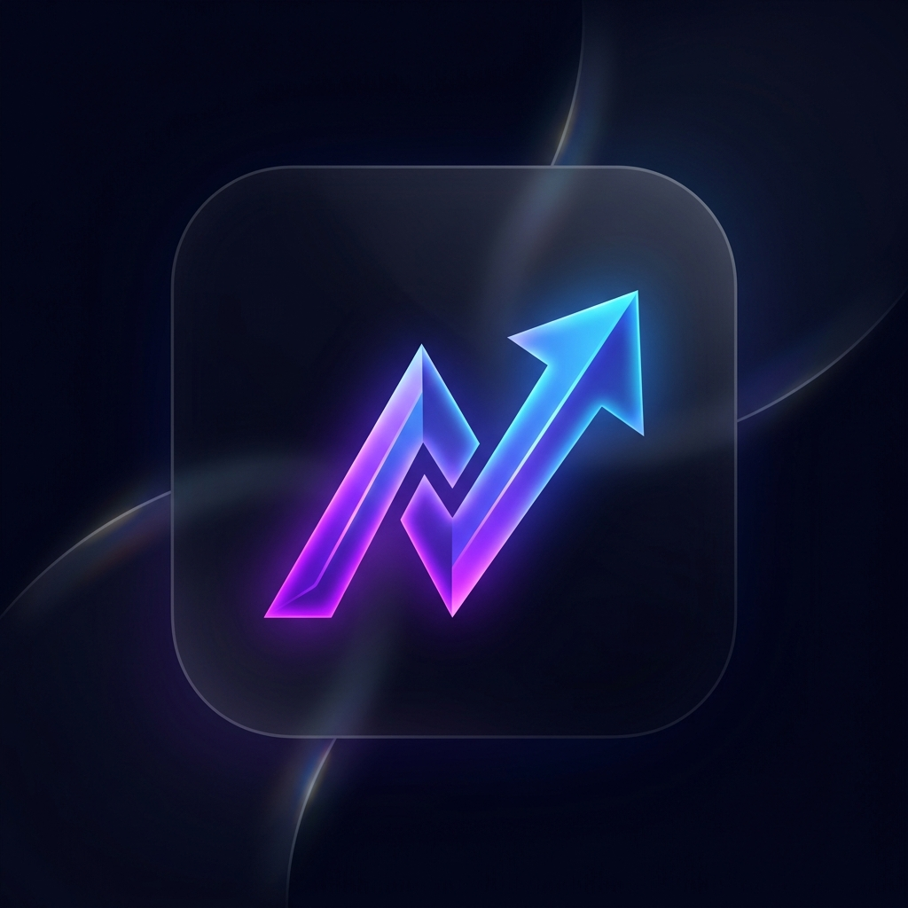

#  ZenWealth | 프리미엄 투자 기록부

**ZenWealth (젠웰스)**는 개인 투자자의 자산 현황을 가장 우아하고 직관적으로 관리할 수 있도록 설계된 프리미엄 투자 저널이자 모바일 웹 애플리케이션입니다. 단순한 금액 기록을 넘어, 입출금 노이즈를 제거한 순수 투자 성과를 시장 지수와 비교 분석하여 당신의 투자 여정을 기록하고 성장을 증명해 드립니다.

---

## ✨ 핵심 기능

### 1. 프리미엄 대시보드 (Dashboard)
- **Apple HIG 준수**: 아이폰의 감성을 그대로 담은 글래스모피즘(Glassmorphism) UI와 부드러운 애니메이션.
- **실시간 지수 비교**: S&P 500, KOSPI, NASDAQ의 실제 시장 데이터를 실시간으로 불러와 내 자산 수익률 곡선과 즉시 비교.
- **스마트 뷰 전환**: 일별, 월별, 연별 추이를 클릭 한 번으로 전환하며 자산의 장단기 흐름을 파악.

### 2. 정밀한 자산 기록 및 분석 (Investment Journal)
- **입출금 노이즈 제거**: 단순 입금으로 인한 자산 증가는 제외하고, 오직 투자 실력에 의한 '순수 증감'만을 차트로 시각화.
- **과거 데이터 복원**: 앱 시작 이전의 과거 자산 기록을 날짜별 스냅샷으로 수동 입력하여 장기적인 포트폴리오 히스토리 구축 가능.
- **히스토리 관리**: 모든 거래 내역과 자산 기록을 개별적으로 편집하거나 삭제할 수 있는 완벽한 관리 기능.

### 3. 모바일 앱 경험 (PWA)
- **홈 화면 추가**: 브라우저 주소창 없이 실제 설치형 앱처럼 구동되는 PWA(Progressive Web App) 기술 적용.
- **전용 프리미엄 아이콘**: ZenWealth만의 미니멀하고 세련된 아이콘 디자인 제공.

---

## 🛠 사용 방법

1. **계좌 등록**: [홈] 탭에서 '+ 계좌 추가'를 눌러 현재 운영 중인 계좌를 등록합니다.
2. **자산 업데이트**: 계좌 상세 화면에서 '잔액 수정'을 하거나 하단 [+] 버튼으로 입출금을 기록합니다.
3. **과거 데이터 추가**: [내역] -> [자산 추이] 탭에서 과거 날짜의 총자산을 입력하여 예전 그래프를 복원합니다.
4. **홈 화면에 추가**: 아이폰(Safari)의 '공유' 버튼 또는 안드로이드(Chrome)의 '설정'에서 '홈 화면에 추가'를 눌러 앱처럼 사용하세요.

---

## 🏗 기술 스택

- **Frontend**: Vanilla JS, HTML5, CSS3 (Glassmorphism Design)
- **Visualization**: Chart.js (Custom Theme)
- **Data Persistence**: LocalStorage (Private Data Storage)
- **Icons**: Lucide Icons
- **Market Data**: Yahoo Finance API (via AllOrigins Proxy)

---

## 📑 Agents 에이전트 시스템

본 프로젝트는 다음과 같은 전문 에이전트 원칙에 따라 개발되었습니다:
- **The Visionary**: 확장 가능한 클린 아키텍처 설계
- **The Aestheticist**: Apple 스타일의 프리미엄 UI/UX 구현
- **The Motion Artist**: 생동감 있는 인터랙션 및 애니메이션 구현
- **The Swift Master**: 고성능 및 반응형 로직 최적화
- **The Reliability Specialist**: 단 하나의 버그도 허용하지 않는 철저한 검증

---

© 2026 ZenWealth Team. All rights reserved.
